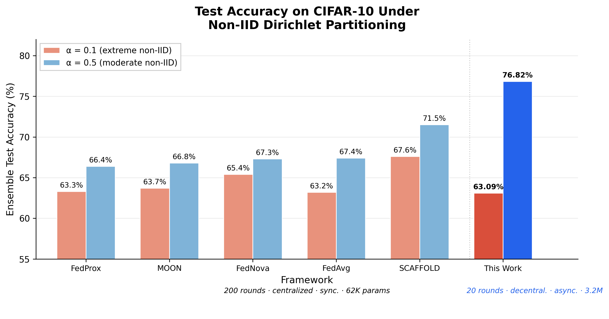
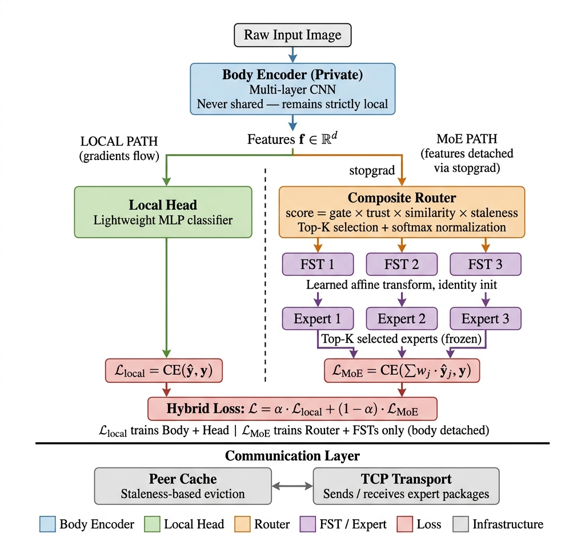
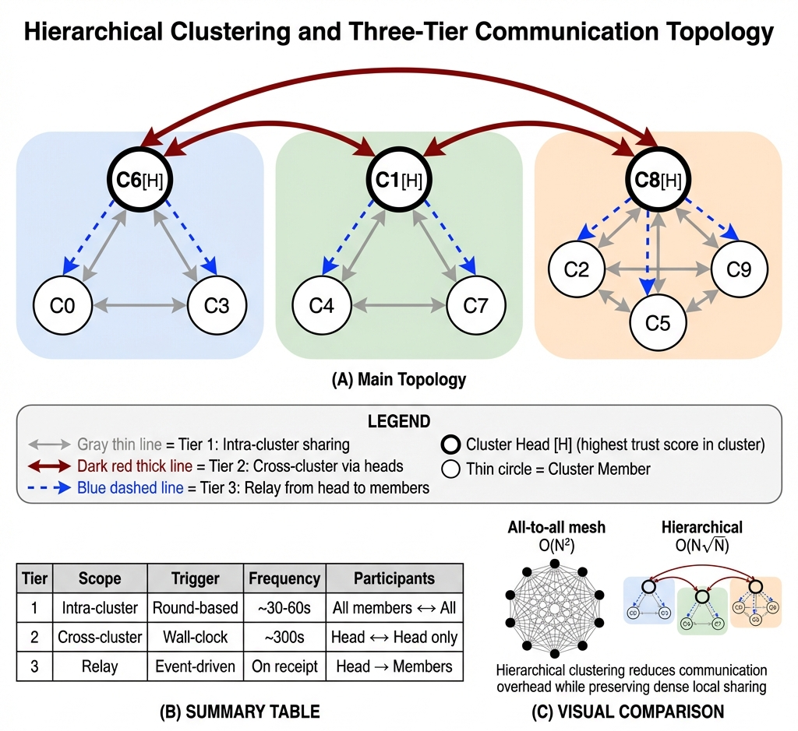

# Adaptive Asynchronous Hierarchical Decentralized Federated Learning with Mixture of Experts

**AAH-dFLMoE** — a serverless federated learning framework that treats client specialization as a routing resource rather than a deficiency to be averaged away.

[](https://www.python.org/)
[](https://pytorch.org/)
[](LICENSE)
[]()

---

## TL;DR

Conventional federated learning (FL) relies on a central parameter server that averages client updates — a design that creates a single point of failure, forces synchronous round barriers, and suppresses per-client specialization when client data distributions are non-IID. **AAH-dFLMoE** replaces this paradigm with a fully decentralized, fully asynchronous, hierarchically clustered Mixture-of-Experts protocol in which:

- Only lightweight expert heads (~134 K parameters, 4 % of a full FedAvg payload) cross the wire.
- Clients never share their body encoders — the 3.24 M-parameter feature extractors remain strictly on-device.
- A composite trust-weighted router selects and weights peer experts per sample using learned gating, validation-derived trust, cosine distributional similarity, and staleness decay.
- Hierarchical K-Means clustering reduces per-round communication complexity from **O(N²) to O(N√N)**.

On CIFAR-10 under Dirichlet-controlled heterogeneity, the framework **exceeded the strongest NIID-Bench baseline (SCAFFOLD) by 5.3 percentage points at α = 0.5** while training for one-tenth the rounds, with no central coordinator, and with no raw-data or body-encoder exposure at any stage.

---

## Table of Contents

1. [Key Results](#key-results)
2. [Why This Project Exists](#why-this-project-exists)
3. [Framework Architecture](#framework-architecture)
4. [Core Technical Contributions](#core-technical-contributions)
5. [Experimental Findings](#experimental-findings)
6. [Installation](#installation)
7. [Quick Start](#quick-start)
8. [Reproducing the Paper Experiments](#reproducing-the-paper-experiments)
9. [Configuration Reference](#configuration-reference)
10. [Repository Structure](#repository-structure)
11. [Testing](#testing)
12. [Limitations & Future Work](#limitations--future-work)
13. [Related Work](#related-work)

---

## Key Results

### Benchmark comparison against five NIID-Bench baselines — CIFAR-10, 10 clients

All five baselines (FedAvg, FedProx, SCAFFOLD, FedNova, MOON) use a centralized synchronous protocol with a single global ~62 K-parameter Simple-CNN trained for **200 rounds**. The proposed framework uses a decentralized asynchronous protocol, trains for **only 20 rounds** (one-tenth the budget), and evaluates via a trust-weighted ensemble of client-local expert heads.

| Data regime | NIID-Bench baselines | **AAH-dFLMoE (ours)** |
|---|---|---|
| α = 0.1 (severe non-IID) | 63.2 % – 67.6 % (range across five methods) | **63.09 %** |
| α = 0.5 (moderate non-IID) | strongest baseline: **SCAFFOLD at 71.5 %** | **76.82 %** |

*At moderate heterogeneity, AAH-dFLMoE exceeded the strongest NIID-Bench baseline (SCAFFOLD) by **5.3 pp** while using a tenth of their training budget. At extreme heterogeneity (α = 0.1), performance tracked the baseline floor. NIID-Bench figures are reported without standard deviations; this framework is reported single-seed.*

<p align="center">
  
</p>

### Additional headline findings

| Metric | Value |
|---|---|
| Ensemble accuracy at α = 0.5 (moderate non-IID) | **76.82 %** |
| IID upper-bound approached by the framework | 80.24 % |
| Wall-clock training-time reduction (async vs sync mode) | **30.3 %** (1.43× speedup) |
| Accuracy retained under asynchronous operation vs synchronous | **98.5 %** |
| Per-message payload reduction vs full-model sharing | **96 %** |
| Per-round communication complexity | **O(N√N)** vs O(N²) for a flat peer-to-peer topology |
| Scalability (N = 20) — accuracy preservation | 93.3 % of N = 10 ensemble accuracy |
| Largest single-component accuracy contribution (MoE path ablation) | 7.11 pp, over 4× the next-largest mechanism |
| Fault-tolerance margin under dropout / churn / rejoin | within 2.2 pp single-seed noise band |

All values are verified measurements from the accompanying research paper.

---

## Why This Project Exists

Federated learning was introduced to train a shared model across distributed clients without exposing raw data. The dominant algorithm, FedAvg, iteratively averages locally trained parameters at a central server. While FedAvg is effective under independent and identically distributed (IID) data, it converges to a compromise model that *suppresses per-client specialization* whenever client data is non-IID — a setting that is the norm rather than the exception in realistic deployments. The NIID-Bench benchmark has systematically cataloged over 20 percentage points of accuracy degradation in this regime.

Recent work has pursued two complementary responses:

1. **Mixture-of-Experts (MoE) architectures** that route each input to a sparse subset of specialist sub-models rather than a monolithic global model.
2. **Asynchronous or decentralized protocols** that eliminate synchronization barriers and remove the central server as a single point of failure.

The prior art has not combined both simultaneously. The closest predecessor, **dFLMoE** (Xie et al., 2025), demonstrated decentralized federated MoE but retains three structural limitations:

- A flat all-to-all topology with **O(N²) per-round communication cost**;
- Synchronous round barriers that idle fast clients behind slow peers;
- Undifferentiated expert routing that ignores staleness, distributional relevance, and per-peer trust.

**AAH-dFLMoE** is designed to address all three limitations simultaneously while preserving the core dFLMoE insight that client heterogeneity is a routing resource.

---

## Framework Architecture

### Per-client architecture — dual-path system with local and MoE branches

<p align="center">
  
</p>

Each client *i* owns four components (only the expert head is ever transmitted):

- **Body Encoder** *B_i* — private multi-layer CNN, 3.24 M parameters, outputs d = 512 features. **Never shared.**
- **Local Head** *H_i* — 2-layer MLP classifier on the local path, ~134 K parameters. The *shared* component.
- **Composite Router** *R_i* — computes the four-factor score (learned gating × trust × cosine similarity × staleness decay) over top-K peer experts; softmax-normalized into aggregation weights.
- **Feature Space Transforms** *FST_{i→j}* — per-peer identity-initialized affine layers that align peer encoder features into the local feature space.

**Hybrid objective:** *L = α · L_local + (1 − α) · L_MoE*, with α following a quadratic warmup from 1.0 (pure local) toward the target value to protect the body encoder during early rounds when the peer expert pool is low-quality. The stop-gradient operator on the MoE branch prevents foreign-expert gradients from corrupting the body encoder's supervised signal.

### High-level system — three-tier hierarchical communication topology

<p align="center">
  
</p>

- **Tier 1 — intra-cluster broadcast.** Every client shares its expert head with its cluster after every training round.
- **Tier 2 — cross-cluster head-to-head exchange.** Elected cluster heads (highest trust score in each cluster) exchange experts on a configurable wall-clock timer.
- **Tier 3 — head-to-member relay.** Incoming cross-cluster experts are event-triggered rebroadcasts to cluster members.

This structure reduces per-round communication complexity from **O(N²)** under a flat all-to-all topology to **O(N√N)** at K_c ≈ ⌊√N⌋ clusters.

### Component summary

| Component | Parameters | Visibility | Purpose |
|---|---|---|---|
| **Body Encoder** (`SimpleCNNBody`) | ~3.24 M | **Private** — never transmitted | Produces 512-dim feature representation from 32 × 32 inputs |
| **Expert Head** (2-layer MLP) | ~134 K | **Shared** — transmitted between peers | Maps features to class logits; the only module on the wire |
| **Composite Router** | Small (per-client) | **Private** | Selects top-K peer experts per sample using the composite score |
| **Feature Space Transform** (FST) | Per-peer, identity-initialized | **Private** | Aligns peer-encoder features into the local feature space without exposing raw data |

---

## Core Technical Contributions

### 1. Hierarchical clustering with a tiered communication protocol

Clients are partitioned into K_c ≈ ⌊√N⌋ clusters via K-Means on L2-normalized representative features. A three-tier protocol carries traffic:

- **Tier 1 (intra-cluster)** — every client broadcasts its expert head to its cluster after every training round.
- **Tier 2 (cross-cluster)** — elected cluster heads exchange experts on a wall-clock timer.
- **Tier 3 (head-to-member relay)** — incoming cross-cluster experts are event-triggered broadcasts to cluster members.

**Result:** per-round communication complexity reduces from O(N²) under all-to-all peer-to-peer exchange to **O(N√N)**, which was matched empirically at both N = 10 and N = 20 within 2 % of the analytic prediction.

### 2. Fully asynchronous expert exchange with staleness decay

Synchronous round barriers are eliminated entirely. Each client trains in its own thread and can emit/consume expert heads at any time. Stale peer contributions are progressively down-weighted by a multiplicative exponential decay factor:

```
staleness_factor = max(ϕ, e^(-λ · Δt))
```

where Δt is the elapsed wall-clock time since a cached expert was last updated. The floor ϕ = 0.1 prevents complete suppression of experts whose updates lag the local pace but whose data-distribution specialization remains valuable for routing diversity.

### 3. Composite trust-weighted expert routing

Each candidate expert *j* receives a scalar score combining **four complementary signals**:

```
s_ij = σ(W_proj · f_i · e_j / √d_h)  ×  T_j  ×  max(0, cos(f_i, f_j))  ×  max(ϕ, e^(-λ·Δt_j))
       └───────── learned gate ─────┘     └trust┘  └── cos similarity ──┘  └─── staleness ───┘
```

A multiplicative combination enforces logical conjunction — if any factor approaches zero, the entire score vanishes, so a stale expert cannot compensate with high trust, and an untrustworthy expert cannot compensate with high similarity. The top-K scores are softmax-normalized into aggregation weights.

### 4. Privacy-preserving architecture via Feature Space Transforms

Only the lightweight expert head network is shared across the network; the body encoder — the main computational component responsible for feature extraction — is **strictly private** on each client. Because independently trained encoders produce independently rotated and scaled feature spaces, a per-peer Feature Space Transform (identity-initialized affine d × d layer) bridges distributional gaps between the sender and receiver feature spaces without exposing any raw data.

---

## Experimental Findings

The framework was evaluated across five studies on CIFAR-10, all in the asynchronous configuration with ten clients unless otherwise noted.

### Study 1 — Benchmark comparison

Described in the Key Results section above. AAH-dFLMoE exceeded the strongest NIID-Bench baseline by **5.3 percentage points** at α = 0.5 while training for **one-tenth the rounds** and with **no central coordinator**. At α = 0.1, performance tracked the baseline floor (63.09 % vs 63.2–67.6 % range).

### Study 2 — Dirichlet heterogeneity sweep

Ensemble accuracy rose monotonically from α = 0.1 to α = 0.5 with diminishing per-step gains, then plateaued within noise.

| Data regime | Ensemble Accuracy |
|---|---|
| Label sharding (2 classes / client) | 35.96 % |
| α = 0.1 | 63.09 % |
| α = 0.2 | 68.81 % |
| α = 0.3 | 73.40 % |
| α = 0.4 | 76.66 % |
| α = 0.5 | 76.82 % |
| IID | 80.24 % |

The 3.42 pp gap between α = 0.5 and IID marks the heterogeneity-robustness ceiling. Label-sharding's sharp collapse is an acknowledged limitation — disjoint label subsets break the distributional-similarity signal the router relies on.

### Study 3 — Component ablation (α = 0.3)

Four ablations against the full asynchronous framework (73.40 % baseline):

| Configuration | Test Accuracy | Δ vs full |
|---|---|---|
| **Full framework (async)** | **73.40 %** | baseline |
| Synchronous mode (barrier enabled) | 74.52 % | +1.12 pp |
| No cluster hierarchy (flat all-to-all) | 72.35 % | −1.05 pp |
| No warmup (α fixed at target) | 72.00 % | −1.40 pp |
| **No MoE (local-only training)** | **66.29 %** | **−7.11 pp** |

The MoE path contributed at least four times the next-largest mechanism. Removing the cluster hierarchy cost 1.05 pp — hierarchy's primary contribution is the O(N²) → O(N√N) communication reduction, not accuracy gain.

### Study 4 — Scalability at N = 20

Doubling the client count to N = 20 at α = 0.3 preserved **93.3 % of the N = 10 ensemble accuracy** (68.51 % vs 73.40 %) and delivered a **2.61× per-round communication reduction** relative to a flat all-to-all topology. The hierarchical per-round message cost grew by ~2.78× from N = 10 → N = 20, matching the O(N√N) analytic prediction (≈2.83×) to within 2 %, which empirically validated the byte-cost-optimal K_c = ⌊√N⌋ = 4 choice at N = 20.

### Study 5 — Fault tolerance (α = 0.3, asynchronous only)

Four fault scenarios were injected at round 100 and evaluated against the unperturbed baseline (73.40 %).

| Scenario | Final Accuracy | Δ | Regime |
|---|---|---|---|
| Client dropout (permanent crash) | 71.25 % | −2.15 pp | within 2.2 pp single-seed noise |
| Dynamic churn (20 % per-round skip) | 73.62 % | +0.22 pp | within noise |
| Crash + rejoin (after 120 s) | 72.66 % | −0.74 pp | within noise |
| **Majority failure (50 % crash)** | **59.34 %** | **−14.06 pp** | steep degradation, consistent with near-majority node loss |

Peer-to-peer expert caching with keep-alive detection and a staleness floor allowed surviving clients to continue routing through cached heads until decay removed them, which explains the graceful degradation under the first three scenarios.

### Study 6 — Gradient isolation 2 × 2 factorial (α = 0.3)

A 2 × 2 factorial ablation varied **stop-gradient isolation** (detaching peer-expert outputs from the body-encoder's gradient path) and the **quadratic warmup schedule** (which phases in the MoE loss over the first ten rounds). The result was unexpected:

- Removing stop-gradient alone: **−1.10 pp**
- Removing warmup alone: **−1.40 pp**
- Additive prediction for removing both: −2.50 pp
- **Measured when both removed: +0.37 pp (not a decline)**
- Interaction magnitude: **+2.87 pp, sign-reversing and strongly sub-additive**

The magnitude falls within single-seed noise (and is therefore reported as indicative rather than conclusive), but the *direction* of the interaction suggests that feature-space-transformed peer-expert gradients may act as a beneficial multi-task regularizer at moderate heterogeneity — questioning the widespread assumption that gradient-isolation is uniformly beneficial across heterogeneity regimes. To the author's knowledge this is the first reported sign-reversing stopgrad–warmup interaction in federated Mixture-of-Experts training.

---

## Installation

### Prerequisites

- **Python** 3.9 or newer
- **CUDA-enabled GPU** strongly recommended (CPU execution is supported but is ~10× slower on CIFAR-10)
- ~2 GB of free disk for dataset caching

### Setup

```bash
# Create a virtual environment (optional but recommended)
python -m venv .venv
source .venv/bin/activate        # Linux / macOS
.venv\Scripts\activate           # Windows

# Install dependencies
pip install -r requirements.txt
```

### Dependencies (`requirements.txt`)

| Package | Version |
|---|---|
| `torch` | ≥ 2.0.0 |
| `torchvision` | ≥ 0.15.0 |
| `numpy` | ≥ 1.24.0 |
| `scipy` | ≥ 1.10.0 |
| `pyyaml` | ≥ 6.0 |
| `tqdm` | ≥ 4.65.0 |
| `matplotlib`, `seaborn` | optional (visualization) |

CIFAR-10 and MNIST are downloaded automatically on first run via `torchvision.datasets`.

---

## Quick Start

```bash
python main.py
```

Runs the default configuration — 10 clients, CIFAR-10, Dirichlet α = 0.5, asynchronous mode, 100 rounds. Results are written to `results/results_cifar10_dirichlet_<timestamp>.txt`.

### Minimal debug run (finishes in < 2 minutes on GPU)

```bash
python main.py --num_clients 3 --num_clusters 1 --rounds 5 \
               --eval_interval 30 --recluster_interval 20
```

---

## Reproducing the Paper Experiments

Each command below reproduces the corresponding study reported in the research paper. All experiments use CIFAR-10 with the asynchronous configuration unless noted. Random seed is fixed at 42.

The paper reports results under a **convergence-matched 20-round budget** (the framework plateaus within this horizon, whereas NIID-Bench Simple-CNN baselines reach comparable plateaus only at ~200 rounds). The commands below therefore pass `--rounds 20` explicitly to match the paper's experimental setup exactly; the CLI default of 100 is a legacy upper bound.

### Main benchmark (Dirichlet α = 0.3, 10 clients)

```bash
python main.py --non_iid_alpha 0.3 --rounds 20
```

### Synchronous ablation (adds the round barrier)

```bash
python main.py --sync --non_iid_alpha 0.3 --rounds 20
```

### Dirichlet heterogeneity sweep

```bash
for alpha in 0.1 0.2 0.3 0.4 0.5; do
  python main.py --non_iid_alpha $alpha --rounds 20
done
```

### MoE loss-weight sweep (α_target)

```bash
for alpha in 0.1 0.2 0.3 0.5; do
  python main.py --alpha $alpha --non_iid_alpha 0.3 --rounds 20
done
```

### Scalability test at N = 20

```bash
python main.py --num_clients 20 --num_clusters 4 --non_iid_alpha 0.3 --rounds 20
```

### Fault-tolerance scenarios (asynchronous only)

```bash
python main.py --fault_scenario dropout   --non_iid_alpha 0.3 --rounds 20   # Permanent client crash
python main.py --fault_scenario rejoin    --non_iid_alpha 0.3 --rounds 20   # Crash + reconnect after --rejoin_delay
python main.py --fault_scenario churn     --non_iid_alpha 0.3 --rounds 20   # Per-round probabilistic skip
python main.py --fault_scenario majority  --non_iid_alpha 0.3 --rounds 20   # 50 % of clients crash permanently
```

### Gradient-isolation 2 × 2 factorial (α = 0.3) — *requires code modification*

The stop-gradient operator is hardcoded as `features.detach()` in `client_node.py` (call site at line 563) and does **not** have a CLI flag. Reproducing Study 6 (the 2 × 2 factorial over stopgrad × warmup) therefore requires editing that line — comment it out to disable stop-gradient — and combining with `--warmup_rounds 0` to disable the warmup schedule. The four conditions are:

| Condition | `detach()` at `client_node.py:563` | Warmup CLI |
|---|---|---|
| Full framework (baseline) | enabled | `--warmup_rounds 10` (default) |
| stopgrad OFF, warmup ON | commented out | `--warmup_rounds 10` |
| stopgrad ON, warmup OFF | enabled | `--warmup_rounds 0` |
| Both OFF | commented out | `--warmup_rounds 0` |

All four runs use `--non_iid_alpha 0.3 --rounds 20` otherwise.

### MNIST mode

```bash
python main.py --dataset mnist --local_epochs 1 --rounds 20
```

### Label-sharding partitioning (2 classes per client)

```bash
python main.py --partition_method label_sharding --classes_per_client 2 --rounds 20
```

---

## Configuration Reference

Full CLI help is available via `python main.py --help`. The most frequently used flags are grouped below.

### System

| Flag | Default | Description |
|------|---------|-------------|
| `--num_clients` | `10` | Total federated clients |
| `--num_clusters` | `3` | Hierarchical clusters (≈ ⌊√N⌋) |
| `--rounds` | `100` | Training rounds per client |
| `--device` | `cuda` | `cuda` or `cpu` |
| `--seed` | `42` | Random seed |
| `--verbose` | off | Print per-round client metrics |

### Data

| Flag | Default | Description |
|------|---------|-------------|
| `--dataset` | `cifar10` | `cifar10` or `mnist` |
| `--partition_method` | `dirichlet` | `iid`, `dirichlet`, or `label_sharding` |
| `--non_iid_alpha` | `0.5` | Dirichlet concentration (lower ⇒ more non-IID) |
| `--classes_per_client` | `2` | Only used with `label_sharding` |
| `--batch_size` | `64` | Training batch size |

### Training

| Flag | Default | Description |
|------|---------|-------------|
| `--alpha` | `0.5` | Local-path loss weight at steady state. The hybrid objective is `L = α · L_local + (1 − α) · L_MoE`, so α = 0.5 weights local and MoE paths equally; α closer to 1.0 emphasizes local training, and α closer to 0.0 emphasizes the MoE path. |
| `--warmup_rounds` | `10` | Rounds over which α decays quadratically from 1.0 (pure local-path) to the `--alpha` target, phasing the MoE loss in gradually to protect the body encoder during early rounds when the peer expert pool is low-quality |
| `--local_epochs` | `3` | Local epochs per round (use `1` for MNIST) |
| `--lr_head` / `--lr_body` / `--lr_router` | `0.001` | Per-component learning rates |
| `--weight_decay` | `1e-4` | L2 regularization |
| `--top_k_experts` | `3` | K in top-K expert selection |
| `--dropout` | `0.3` | Dropout rate in expert heads |

### Asynchronous behavior

| Flag | Default | Description |
|------|---------|-------------|
| `--sync` | off | Enable synchronous round barrier (ablation) |
| `--staleness_lambda` | `0.005` | Exponential decay rate λ in `e^(-λ·Δt)` |
| `--staleness_floor` | `0.1` | Minimum staleness factor ϕ |
| `--max_expert_age` | `300.0` | Seconds before cache eviction |
| `--cross_cluster_interval` | `60.0` | Inter-cluster exchange period (s) |
| `--eval_interval` | `300.0` | Wall-clock seconds between evaluations |
| `--recluster_interval` | `150.0` | Wall-clock seconds between re-clustering |

### Fault tolerance (async only)

| Flag | Default | Description |
|------|---------|-------------|
| `--fault_scenario` | `None` | `dropout`, `rejoin`, `churn`, or `majority` |
| `--rejoin_delay` | `120.0` | Seconds before clients reconnect |

### Output files

Each run writes one timestamped file to `results/`:

```
results/results_<dataset>_<partition_method>[_fault-<scenario>]_<YYYYMMDD-HHMMSS>.txt
```

Contents:

1. Configuration header — all CLI arguments for exact reproducibility
2. Per-evaluation table — wall-clock time, global test accuracy, train/val accuracy, cache size, experts used, per-client round counts (min / avg / max)
3. Fault-events log (only when a fault scenario is active)
4. Final results — best and final test accuracy, total training time
5. Per-client statistics — trust score, rounds completed, experts sent / received / used, cache size, status

---

## Repository Structure

```
Adaptive-Asynchronous-Hierarchical-dFLMoE/
├── main.py                  # Entry point: orchestration, data loading, evaluation, results saving
├── client_node.py           # Per-client training loop, hybrid loss, expert sharing
├── requirements.txt         # Python dependencies
│
├── configs/
│   └── config.yaml          # Reference config (documentation only; CLI flags are authoritative)
│
├── models/
│   ├── body_encoder.py      # SimpleCNNBody — private 3.24 M-param CNN feature extractor (d = 512)
│   ├── head.py              # 2-layer MLP expert head — the only shared component (~134 K params)
│   ├── fst.py               # Feature Space Transform — identity-initialized affine alignment
│   └── router.py            # Composite trust-weighted router (4-factor scoring)
│
├── infra/
│   ├── cluster.py           # K-Means hierarchical clustering manager
│   ├── peer_cache.py        # Thread-safe expert cache with staleness decay
│   └── transport.py         # TCP peer-to-peer communication layer
│
├── utils/
│   ├── config_loader.py     # YAML config loader (optional)
│   ├── data_utils.py        # Non-IID partitioning: iid / dirichlet / label_sharding
│   └── logger.py            # Logging helpers
│
├── tests/
│   ├── cluster_test.py      # Clustering unit test
│   └── transport_test.py    # Transport unit test
│
├── data/                    # Datasets — auto-downloaded on first run
├── results/                 # Output results — auto-created; one timestamped .txt per run
└── logs/                    # Runtime logs
```

---

## Testing

```bash
python -m tests.cluster_test
python -m tests.transport_test
```

Unit coverage is currently focused on the clustering manager and the TCP transport layer.

### Troubleshooting

| Problem | Fix |
|---|---|
| CUDA out of memory | Reduce `--batch_size` to 32 or use `--device cpu` |
| Port already in use | Wait a few seconds between runs — the transport uses random localhost ports that can occasionally collide |
| MNIST shape mismatch | MNIST is resized to 32 × 32 automatically; ensure `--dataset mnist` is set |
| Client never recovers | Fault scenarios require asynchronous mode — do not pass `--sync` together with `--fault_scenario` |
| Slow convergence at low α | Expected — at α close to 0 the framework reduces to local-only training. Compare against α = 0.3–0.5 for the main-result configuration |

---

## Limitations & Future Work

The paper explicitly documents the following limitations, each paired with a concrete remediation path:

| Limitation | Future direction |
|---|---|
| Single-seed, single-dataset evaluation | Multi-seed replication across CIFAR-100 and FEMNIST for statistical strength |
| Label-sharding boundary collapse (accuracy drops to 35.96 %) | Class-conditional or prototype-based routing to handle fully disjoint label subsets |
| Fixed hyperparameters across regimes | Adaptive hyperparameter tuning keyed to observed heterogeneity |
| Loopback-simulated networking (same-machine TCP) | Geographically distributed deployment under real-world network latency |
| No formal Byzantine-robustness guarantees | Cross-validation of received expert heads before admission to the peer cache |
| No formal differential-privacy guarantees | DP-SGD applied during expert-head training |
| Gradient-isolation finding (Study 6) is indicative only | Multi-seed replication to determine precise heterogeneity threshold for the sign-reversal |

These are known design limits of the current research prototype, not defects in the codebase.

---

## Related Work

References cited in the accompanying technical paper:

L. Xie, T. Luan, W. Cai, et al., "dFLMoE: Decentralized federated learning via mixture of experts for medical data analysis," arXiv preprint, arXiv:2503.10412, 2025. Available: https://arxiv.org/abs/2503.10412

H. B. McMahan, E. Moore, D. Ramage, et al., "Communication-efficient learning of deep networks from decentralized data," in Proc. Int. Conf. Artif. Intell. Statist. (AISTATS), 2017. Available: https://arxiv.org/abs/1602.05629

T.-M. H. Hsu, H. Qi, and M. Brown, "Measuring the effects of non-identical data distribution for federated visual classification," arXiv preprint, arXiv:1909.06335, 2019. Available: https://arxiv.org/abs/1909.06335

Q. Li, Y. Diao, Q. Chen, et al., "Federated learning on non-IID data silos: An experimental study," in Proc. IEEE Int. Conf. Data Eng. (ICDE), 2022. Available: https://arxiv.org/abs/2102.02079

N. Shazeer, A. Mirhoseini, K. Maziarz, et al., "Outrageously large neural networks: The sparsely-gated mixture-of-experts layer," in Proc. Int. Conf. Learn. Represent. (ICLR), 2017. Available: https://arxiv.org/abs/1701.06538

E. Listo Zec, O. Mogren, J. Martinsson, et al., "Specialized federated learning using a mixture of experts," arXiv preprint, arXiv:2010.02056, 2020. Available: https://arxiv.org/abs/2010.02056

M. Reisser, C. Louizos, E. Gavves, et al., "Federated mixture of experts," arXiv preprint, arXiv:2107.06724, 2021. Available: https://arxiv.org/abs/2107.06724

L. Yi, H. Yu, C. Ren, et al., "pFedMoE: Data-level personalization with mixture of experts for model-heterogeneous personalized federated learning," arXiv preprint, arXiv:2402.01350, 2024. Available: https://arxiv.org/abs/2402.01350

P. Tholoniat, H. A. Inan, J. Kulkarni, et al., "Differentially private training of mixture of experts models," arXiv preprint, arXiv:2402.07334, 2024. Available: https://arxiv.org/abs/2402.07334

Y. Su, N. Yan, Y. Deng, et al., "PWC-MoE: Privacy-aware wireless collaborative mixture of experts," arXiv preprint, arXiv:2505.08719, 2025. Available: https://arxiv.org/abs/2505.08719

Z. Y. Zhang, B. Ding, and B. K. H. Low, "PC-MoE: Memory-efficient and privacy-preserving collaborative training for mixture-of-experts LLMs," arXiv preprint, arXiv:2506.02965, 2025. Available: https://arxiv.org/abs/2506.02965

J. Nguyen, K. Malik, H. Zhan, et al., "Federated learning with buffered asynchronous aggregation," in Proc. Int. Conf. Artif. Intell. Statist. (AISTATS), 2022. Available: https://arxiv.org/abs/2106.06639

F. Sattler, K.-R. Müller, and W. Samek, "Clustered federated learning: Model-agnostic distributed multi-task optimization under privacy constraints," arXiv preprint, arXiv:1910.01991, 2019. Available: https://arxiv.org/abs/1910.01991

D. P. Kingma and J. Ba, "Adam: A method for stochastic optimization," in Proc. 3rd Int. Conf. Learn. Represent. (ICLR), San Diego, CA, USA, 2015. Available: https://arxiv.org/abs/1412.6980

T. Li, A. K. Sahu, M. Zaheer, et al., "Federated optimization in heterogeneous networks," in Proc. Mach. Learn. Syst. (MLSys), 2020. Available: https://arxiv.org/abs/1812.06127

S. P. Karimireddy, S. Kale, M. Mohri, et al., "SCAFFOLD: Stochastic controlled averaging for federated learning," in Proc. Int. Conf. Mach. Learn. (ICML), 2020. Available: https://arxiv.org/abs/1910.06378

J. Wang, Q. Liu, H. Liang, et al., "Tackling the objective inconsistency problem in heterogeneous federated optimization," in Proc. Adv. Neural Inf. Process. Syst. (NeurIPS), 2020. Available: https://arxiv.org/abs/2007.07481

Q. Li, B. He, and D. Song, "Model-contrastive federated learning," in Proc. IEEE/CVF Conf. Comput. Vis. Pattern Recognit. (CVPR), 2021. Available: https://arxiv.org/abs/2103.16257
